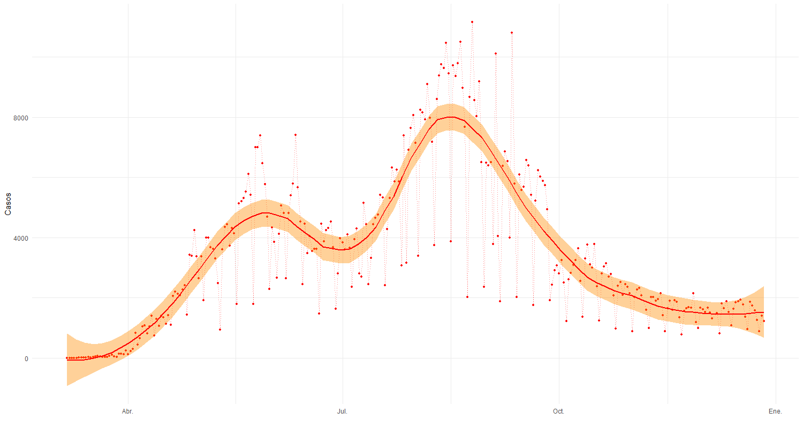
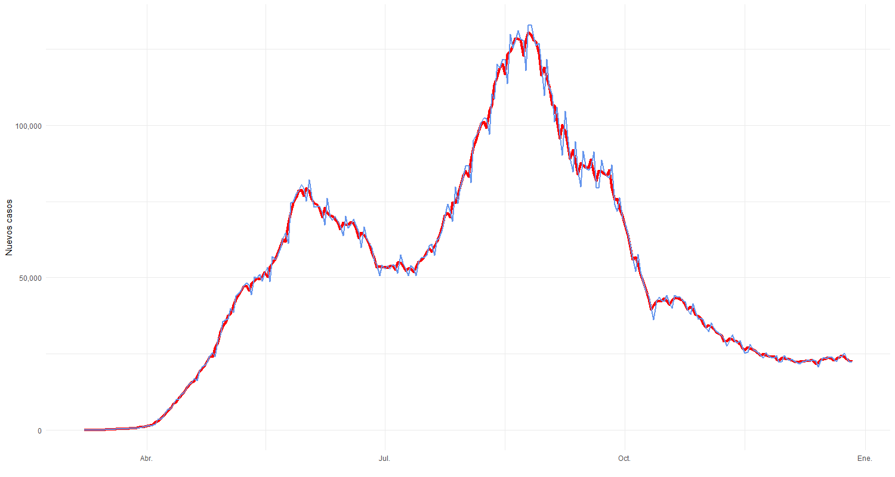
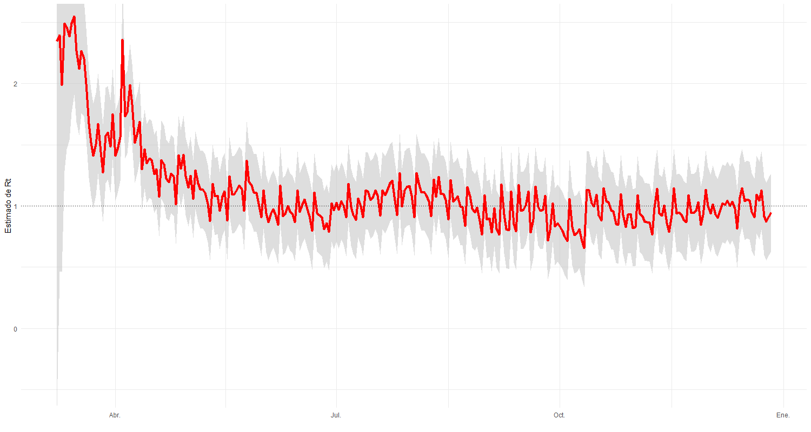

**28 de julio del 2020**. Martín Vizcarra, presidente del Perú, anunciaba el final de la cuarentena total y el inicio de una nueva etapa el 31 de julio, día que finaliría el estado de emergencia sanitaria. El argumento: el factor de contagio $R_{t}$ era menor a 1 en 16 regiones del país.

```{r echo = FALSE, fig.align='center'}
library(tweetrmd)
tweet_embed(tweet_url = "https://twitter.com/canalN_/status/1281000171392958467?s=20",
            align = "center")
```
<br>
Como muchas otras de las decisiones del señor Vizcarra, esta mostró ser equivocada. El país procedería a pasar por el peor momento de la pandemia en el 2020 aproximadamente un mes y medio después de su anuncio. Sin embargo, aunque la decisión no fuese la correcta, al menos uno de sus criterios sí lo era. El número de reproducción o factor de contagio ($R_{t}$), es comúnmente utilizado para reflejar qué tan infecciosa es una enfermedad en un momento del tiempo. Por ello, se usa este indicador para evaluar medidas para mitigar una epidemia/pandemia, porque cambia frente a medidas de control.

En este breve artículo, presentaré la estimación del factor de contagio $R_{t}$ para la primera ola de COVID-19 en el Perú, siguiendo el ejemplo y código de [Thomas P. Vladeck](https://tomvladeck.com/2020/04/15/rt-ssm.html). Al igual que él, debo aclarar que no soy epidemiólogo, así que me limito a estimar [un modelo ya existente](https://journals.plos.org/plosone/article?id=10.1371/journal.pone.0002185#ack)[^1]. Utilizaremos R, y echaremos mano del paquete [KFAS](https://cran.r-project.org/web/packages/KFAS/index.html).

# La teoría
<br>
Partimos de la siguiente ecuación, tomada del paper de [Bettencourt y Ribeiro (2008)](https://journals.plos.org/plosone/article?id=10.1371/journal.pone.0002185#ack)

$$I_{t+\tau}=I_{t}e^{\tau\gamma(R_{t}-1)}$$
En donde:

- $I_{t}$ es el número de personas contagiadas en el periodo $t$
- $\tau$ es la distancia en el tiempo
- $\gamma$ es el inverso del periodo de aparición de síntomas de la enfermedad
- $R_{t}$ es el factor de contagio

¿Qué nos dice esta ecuación? Que el $R$ varía con el tiempo, y que es una función de la relación entre la cantidad de casos detectados hoy y los de hace $\tau$ días. Si esta expresión te parece familiar, probablemente hayas llevado algun curso de finanzas alguna vez en tu vida. La explicación es que la ecuación anterior es muy similar a la del interés compuesto en tiempo continuo[^2]. Haciendo este paralelo, podemos entender la parte $\gamma(R_{t}-1)$ como una tasa de interés, que a partir de ahora llamaremos $\theta_{t}$.

El principal problema con la variable $I_{t}$ es que no la podemos observar. Lo único que podemos ver es la cantidad de casos nuevos reportados a través de pruebas con resultado positivo (en este caso, de COVID-19). 

# El modelo empírico

La pregunta ahora es, ¿Cómo estimamos la ecuación anterior? Quizá una aproximación correcta sea partir de utilizar una distribución *poisson*. Esta distribución [es utilizada](https://en.wikipedia.org/wiki/Poisson_distribution) para modelar datos de conteo, es decir, el número de veces que ocurre cierto fenómeno aleatorio en un periodo de tiempo. Es adecuada para este caso.

Utilizando esta información, diremos que $I_{t+1}$ se distribuye como una *poisson* con parámetro $I_{t}e^{\theta_{t}}$ [^3], o

$$I_{t+1} \sim Poisson(I_{t}e^{\theta_{t}})$$

en donde $\theta_{t}$ representa la tasa esperada de crecimiento de contagios. Dado nuestro modelo, establecemos que  $\theta_{t}=\gamma(R_{t}-1)$, que quiere decir que $\theta_{t}$ depende del factor de contagio $R_{t}$. Si logramos estimar $\theta_{t}$, será posible despejar y hallar $R_{t}$. Sin embargo, una *regresión poisson* regular estima un $\theta$ constante, lo cual no nos permitiría identificar como cambia el $R$ con el tiempo, que es nuestro objetivo.

Por ello, modelamos la dinámica de la variable $\theta_{t}$ a través de la siguiente expresión:

$$\theta_{t}\sim N(\theta_{t-1},\sigma)$$
Las últimas dos ecuaciones conforman nuestro modelo de espacio-estado, que procederemos a estimar más adelante. 

# Los datos 

Estimaremos el modelo anterior utilizando [datos del Ministerio de Salud](https://www.datosabiertos.gob.pe/dataset/casos-positivos-por-covid-19-ministerio-de-salud-minsa). La discusión sobre qué serie es mejor utilizar y la calidad de los datos no es trivial, pero excede el propósito de este ejercicio. 

Cargamos los paquetes necesarios:

```{r eval=FALSE}
library(tidyverse)
library(KFAS) # Estimación del modelo
library(zoo) # Algunas funciones
```

Descargamos y leemos la base:

```{r eval=FALSE}
# URL del archivo a descargar
url <- "https://cloud.minsa.gob.pe/s/Y8w3wHsEdYQSZRp/download"
# Nombre del archivo de destino
destfile <- "./base.csv"

# Descargamos la base
tryCatch(download.file(url, destfile, mode = "wb", quiet = FALSE), 
         error = function(e) print("Error en la descarga"),
         cacheOK = F)

# Leemos la base
dat <- read.csv("./base.csv", sep = ";")
```

La base contiene 1 653 320 filas y 9 columnas. Cada una de las observaciones de la base representa una prueba COVID-19 con resultado positivo y contiene el registro de la fecha en la que se reveló el resultado, tipo de prueba, entre otras cosas.

Contaremos los casos por día, tomando como referencia la fecha del resultado. Además, calcularemos los casos acumulados. Descartamos los últimos 3 días (pues la información podría no estar actualizada en su totalidad) y guardamos el resultado en el objeto `df`.

```{r eval=FALSE}
df <- dat %>% 
        select(FECHA_RESULTADO) %>% # Modificamos el formato de la fecha
        mutate(FECHA_RESULTADO = as.character(FECHA_RESULTADO),
                     fecha = as.Date(paste0(substr(FECHA_RESULTADO,1,4), "-",
                                            substr(FECHA_RESULTADO,5,6), "-",
                                            substr(FECHA_RESULTADO,7,8)))) %>%
        count(fecha) %>% # Contamos el número de casos por día
        filter(fecha < as.Date("2020-12-31")) %>% # Sólo hasta diciembre
        mutate(acum = cumsum(n)) %>% # Calculamos el acumulado
        head(-3) # Quitamos los últimos 3 días
```

Echemos un vistazo a los datos:

```{r, echo = FALSE, fig.align="center", fig.width=100, fig.height=80, fig.cap="Nuevos casos reportados durante la primera ola"}

```
<br>
Muy bien. La serie suavizada representa bien el comportamiento de la pandemia durante el 2020, y tiene una importante relación con las muertes diarias reportadas por SINADEF. 

Antes de seguir, unas cuantas líneas de procesamiento adicional de las series.

```{r eval=FALSE}
serie <- df %>% 
        pull(acum) %>% 
        diff %>% 
        {c(rep(0, ventana-1), .)} %>% 
        rollsum(., ventana) # Rearmamos la serie de contagios acumulados para que                                  considere los nuevos casos en la ventana de 15 días

fechas <- df %>% pull(fecha) %>% tail(-2) # Acomodamos el vector de fechas
```

Armemos las dos series de la ecuación de espacio de nuestro modelo, $I_{t}$ (`it`) y $I_{t+1}$ (`it1`)

```{r eval=FALSE}
it = serie[-length(serie)]
it1 = serie[-1]
```

Listo. Procedamos a la estimación.

# Estimación

Definamos algunos parámetros. La ventana de suavizamiento de los datos será de 15 días y el intervalo serial tendrá un valor de 4 (siguiendo [la estimación de Kevin Systrom](http://systrom.com/blog/the-metric-we-need-to-manage-covid-19/?fbclid=IwAR0BpVPn0PlcaIrw5v58BiUB9MAGQ4zqpIw1RD24z-q9_nsNLBt2In-OJxc)). El $\gamma$ es el inverso del intervalo serial.

```{r eval=FALSE}
ventana <- 15
intervalo <- 4
gamma <- 1/intervalo
```

Utilizando la función `SSModel()` del paquete `KFAS`, definimos nuestro modelo a estimar, especificando el factor de *offset* ($I_{t}) y la distribución (*Poisson*)

```{r eval=FALSE}
modelo = SSModel(
        it1 ~ 1, 
        u = it,
        distribution = "poisson"
)
```

Procedemos a estimar el parámetro $\sigma$ de la ecuación de estado de nuestro modelo. Con las siguientes líneas, estimamos $\sigma$ utilizando una estimación por máximo de verosimilitud.

```{r eval=FALSE}
modelo$Q[1,1,1] = NA

modelo_fit = fitSSM(modelo, c(1,1))
```

Una vez realizado esto, podemos filtrar recursivamente y suavizar $\theta$

```{r eval=FALSE}
modelo_fit_filtered = KFS(
        modelo_fit$model, c("state", "mean"), c("state", "mean"))
```

En este punto, es útil comparar nuestra serie estimada de contagios diarios (celeste) con los datos reales (rojo). Notamos que las series son muy similares, lo que debería dejarnos satisfechos con el desempeño del modelo.

```{r, echo = FALSE, fig.align="center", fig.width=100, fig.height=80, fig.cap="Nuevos casos estimados vs datos reales"}

```

# Hallando $R_{t}$

Extraemos los estimados de $\theta$, además de intervalos de confianza al 95\% (tomando los valores de la distribución normal), en un *tibble*. Asimismo, descartamos las tres primeras observaciones.

```{r eval=FALSE}
theta <- tibble(promedio = modelo_fit_filtered$a[, 1],
                superior = promedio + 1.96*sqrt(modelo_fit_filtered$P[1,1,]),
                inferior = promedio - 1.96*sqrt(modelo_fit_filtered$P[1,1,])) %>%
        tail(-2)
```

Una vez obtenido el $\theta_{t}$, utilizamos la igualdad $\theta_{t}=\gamma(R_{t}-1)$
para despejar y obtener $R_{t}$. Sencillamente calculamos `{r} rt <- theta/gamma + 1`

¡Listo! podemos ahora graficar nuestro $R_{t}$ estimado junto con sus respectivos intervalos de confianza.

```{r, echo = FALSE, fig.align="center", fig.width=100, fig.height=80, fig.cap="Factor de contagio estimado"}

```

# Conclusiones

En este breve artículo, hemos desarrollado algunos conceptos sobre el famoso **factor de contagio** o **número de reproducción** que tanto afecta hoy en día nuestras vidas, y hemos realizado un ejercicio de estimación del mismo para el caso peruano utilizando R. 

Nuestras estimaciones son relativamente similares a algunas de las presentadas por [Vega y Lahura (2020)](https://www.bcrp.gob.pe/docs/Publicaciones/Revista-Moneda/moneda-184/moneda-184-08.pdf). Observamos un $R_{t}$ superior a 2 durante el inicio de la pandemia, que se fue reduciendo conforme hicieron efecto las medidas de contención del virus. A partir del mes de mayo, los intervalos de confianza no nos permiten afirmar mucho sobre el comportamiento del $R_{t}$, pero en general observamos un aumento por encima de 1 durante septiembre-agosto, que fue el pico de la pandemia en el 2020.

Evidentemente, nada de lo aquí presentado debe tomarse como evidencia cienfífica ni nada por el estilo. Es realizado con fines meramente explicativos y pedagógicos. ¿Cómo podemos mejorar esta estimación? En primer lugar, podemos dudar sobre la calidad de nuestros datos. La gestión del testeo masivo fue (y sigue siendo) muy deficiente por parte del gobierno peruano. Las pocas pruebas diarias aplicadas y la amplia dominancia de pruebas rápidas por sobre las moleculares se encuentran entre los factores que contribuyen a que estos datos no reflejen el verdadero número de contagiados como deberia. Algunas otras consideraciones sobre el modelo y posibles extensiones pueden ser halladas en la publicación de [Thomas P. Vladeck](https://tomvladeck.com/2020/04/15/rt-ssm.html).

Cualquier comentario o crítica es siempre bien recibido.

**¡Hasta la próxima!**

<br>

[^1]: No existe una sola manera "correcta" de estimar este factor. Los epidemiólogos han desarrollado diversos modelos teóricos y empíricos a lo largo de los años.
[^2]: $valorfinal=valorinicial*e^{ti}$, en donde $t$ es el tiempo e $i$ es la tasa de interés
[^3]: Asumimos $\tau=1$, es decir, la relación es entre los contagiados de hoy y los de mañana.

